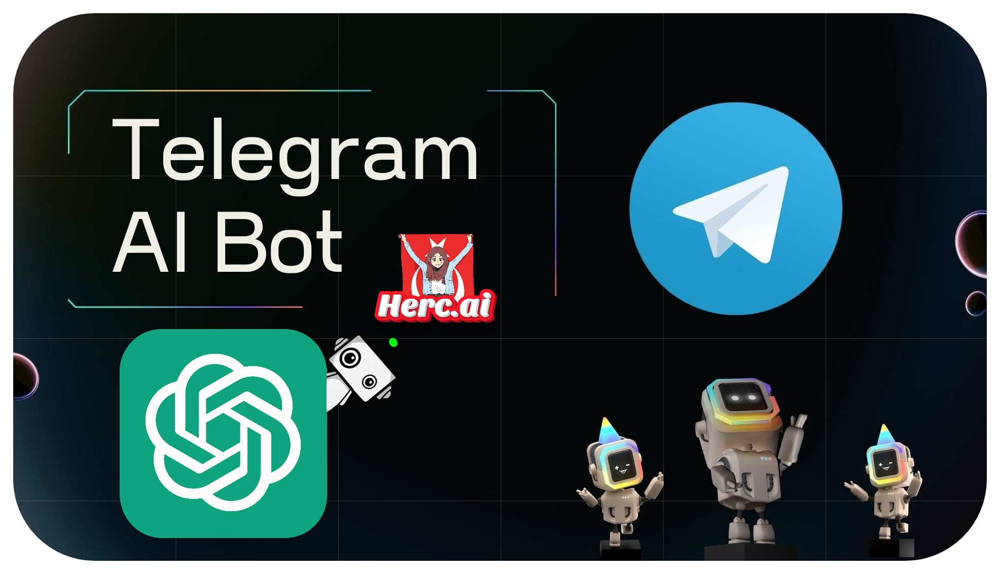

# [Telegram AI](https://discord.gg/luppux) Bot

> **A Telegram AI bot designed to understand and respond to user messages with artificial intelligence capabilities.**
> **It is powered by Herc.ai so ChatGPT.**

# 🖼️ Images

<b>Click to View Images</b>

# 📗 Installation

## - Local launch

1. Clone this repo: `git clone https://github.com/Bes-js/TelegrAI`
2. Fill in the required values in the `.env` or `src/config/settings.ts` file.
3. Run `npm install -D typescript`
4. Run `npm install -D ts-node`
5. Run `npm install` in the root folder
6. Run `npm run start` in the root folder or Run `start.bat`
7. Your bot is now ready for use.

And you should be good to go! Feel free to fork and submit pull requests. Thanks!

## - Environment variables

| Variable              | Description                                     | Type  |
| ----------------------| ------------------------------------------------|-------|
| `telegramBotToken`    | *You can get your bot token from [@BotFather](https://t.me/BotFather) on Telegram.*|**String** |
| `hercaiApiKey`        | *There is a limit of 15 requests per minute in free use, you must make a one-time fee to make unlimited requests, you can purchase a one-time unlimited Hercai API Key from [Hercai Shop](https://hercai-shop.onrender.com), the fee is low. `If Your API Key Doesn't Exist, Leave It Blank`* |**String** |
| `eighteenPlusFilter`  | *If you want to filter +18 prompt, set it to true. (Default: false)* |**Boolean**|

*Fill in the **`.env`** file, or you can perform the same operations via **`src/config/settings.ts`**.*

# 📜 License

[***Apache License 2.0 - Click to Get Information About the License!***](./LICENSE.md)

# 📫 Support & 💲 Donate

